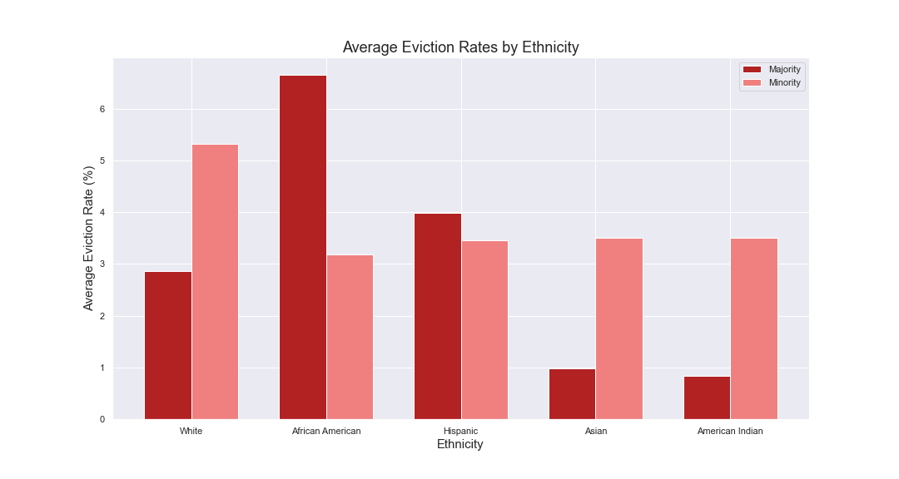
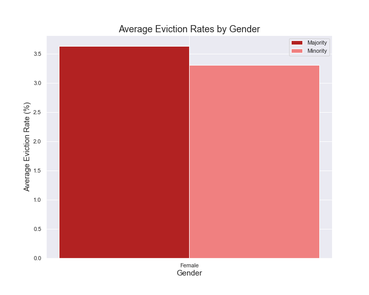
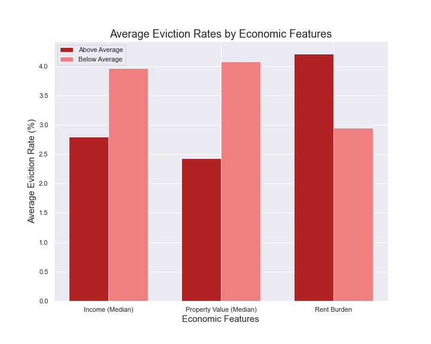

# Predicting Eviction Rates  

**Author:** Jack Mannix

## Overview 

To address the skyrocketing rate of evictions in the United States, the focus of this project is to predict the eviction rate of a  census tract based upon its socioeconomic demographics and history of evictions.

## Background 

A person is evicted when they are expelled from a property by the property’s landlord. Landlords can evict tenants for a variety of reasons, including unpaid rent, or damaged properties; however, landlords can perform ‘no-fault evictions,’ when a tenant has not violated their leasing contract. Evictions should not only be observed as an issue of housing, but as an issue of public health as well. A family that experiences an eviction is much more likely to experience a host of mental health issues, job loss, and homelessness. As the COVID-19 pandemic persists and the national eviction moratorium has ended, many Americans are finding that they are at a higher risk of eviction as contracting COVID-19 as a direct result. 

- [source](https://evictionlab.org/why-eviction-matters/#eviction-impact)

The ability to foresee a census tract’s eviction rate is crucial for the allocation of appropriate resources. 90% of tenants facing evictions do not receive legal representation for their legal case, and are much more likely to be evicted than the 10% with representation. Knowing this, the ability to foresee a census tract’s eviction rate is crucial for allocating free legal resources in areas that face the greatest risks of eviction.

- [source](https://www.irp.wisc.edu/publications/fastfocus/pdfs/FF22-2015.pdf)

## Methodology 
### Data Aquisition
 
The data used for this project was obtained from the Eviction Lab and the American Community Survey (ACS) from census.gov. The Eviction Lab is a team of researchers based at Princeton University  who have created a national database from over 10,000,000 eviction records from 2000 to 2016. 
 
 
**Find The Data Files Here:**
- [Eviction Lab Census Tract Data](https://data-downloads.evictionlab.org/)
- [US Census](https://data.census.gov/cedsci/table?t=Populations%20and%20People&d=ACS%205-Year%20Estimates%20Data%20Profiles&tid=ACSDP5Y2015.DP05)

 
### Data Preparation

The Eviction Lab provides their data at various levels of granularity (state, county, census tract, and block group). This project utilizes the data at the census tract level as it provides a good balance of granularity, unlike the state and county levels, without having large amounts of missing data, like the block group level.

While the data has been collected by census tract from 2000 - 2016, the majority of census tracts are missing records from different years, making time series analysis difficult. To avoid subsetting a very small dataset with consistency in its recorded years, the data is aggregated by census tract, so that each continuous feature value is the mean of all available annual records from a particular census tract. Mean was selected as the method of aggregation over median in order to produce a model that can make sufficient predictions despite the existence of outliers.

Typically, a model built to predict the eviction rate of a census tract for the year 2022 would not be able to utilize the total number of evictions or eviction filings as features as these records as these numbers would not be available until the end of the year. However, by taking the mean of every available year from a particular census tract, these features can be used to make predictions for upcoming years. This aggregation method proves to be very advantageous, as these features are identified as highly important throughout the iterations of modeling.

### Data Cleaning
Dropped Data
1. Census tracts with null eviction rates after aggregation 
2. Census tracts with a population of 0
3. Census tracts from states with counts < 400
    - NM, HI, IN, CA, RI, DE, ME, KS, WY, OK, LA, VT, MO, TN
4. Census tracts with eviction rates > 90%
    - Eviction Rate =  # Evictions / # renter occupied properties
    - Based upon the formulate for eviction rate it is possible for census tracts to have extremely high eviction rates if there is a single eviction and a low number of renter occupied properties
    
## Data Exploration
### Eviction Rates Amongst Ethnicity Majorities

Key Findings
1. Groups with higher eviction rates when possessing a majority 
    - African American 
    - Hispanic
2. Groups with higher eviction rates when possessing the minority
    - White
    - Asian
    - Native American
3. All t-tests conducted on the eviction rates of a particular groups majority and minority census tracts were significant (<0.05)
4. There are no census tracts in which Native Hawaiin / Pacific Islander, Other, or Multiple have a majority 

### Eviction Rates Amongst Gender Majorities

The same analysis above is also conducted for gender.
 

Key Findings
1. Census tracts with women holding a majority have a median eviction rate that is 0.21% higher than the median eviction rate of census tracts with men holding a majority 
3. All t-test results are significant (<0.05)

### Eviction Rates By Income, Property Value, and Rent Burden

 

Key Findings
1. Census tracts with below average incomes and property values have higher eviction rates
    - Average Income = $52,247.93
    - Average Property Value = $180,000
2. Census tracts with above average rent burdents have higher eviction rates 
    - Average Rent Burden = 29.4%

## Modeling
### Models Used
1. Linear Regression
2. RandomForest
3. XGBoost
4. Neural Networks (MLN)

### Feature Engineering

The curse of dimensionality is a limiting factor for trying to engineer geographical features. Treating each census tract or their respective counties as individual geographic features would result in thousands of features. To create features utilizing geographical groupings, the nine US Census Regions (map) are used to group census tracts to their respective regions.

### Feature Selection
- **(Target) Eviction Rate** = #Evictions/#Renter Occupied Households
- **Eviction Filing Rate** = #Filed Evictions /#Renter Occupied Households
- **Renter Occupied Households** = # Renter Occupied Households
- **Pct Renter Occupied Households** = # Renter Occupied Households / Population

Based upon their formulas, the inclusion of all of the features above would result in the model using these numbers to perfectly calculate the target variable (eviction rate). Because of this, different feature combinations were used during separate iterations. Significant improvement in R-Squared and RMSE scores resulted from using Eviction Filing Rate and  (#)Evictions.

### Outlier Removal

Initial exploration reveals many outliers throughout the dataset, so IsolationForest is implemented with an iterative approach to determine how many and which outliers are removed. After several iterations of IsolationForest with varying contamination parameters, a contamination of 0.05%, removing 18 outliers from the training dataset, yields an improvement in both R-Squared and RMSE values.

## Final Model

XGBoost (trained on IsolationForest data)

- R-Squared
    - Train = 0.9467
    - Test = 0.9435
- RMSE 
    - Train = 0.8258
    - Test = 0.8191
    

The final model is able to account for 94% of the variance in observed census tract eviction rates based upon the available features, and is able to predict an eviction rate within 0.81 percentage points.

### Feature / Permuation Importances

Comparisons between the final model's feature importances and permutation importances offer valuable insight into the functioning of the model.
.

Key Findings
1. Evicition Filing Rate is calculated as the most important features by both methods

## Going Forward

1. Evaluate and train the model on data collected from 2017 to present 
2. Incorporate additional features
    - crime rates, gov. services utilized, etc. 
3. Conduct time series analysis

**Note**
- Given the timeframe of the available data from the Eviction Lab (up to 2016), data related to the COVID-19 pandemic is  irrelevant for analysis
- It is likely that analysis from 2020 and 2021 will be impacted by interventions such as eviction moratoriums 

# Further Information 

For further information regarding the analysis, please view the [Jupyter Notebook](final_notebook.ipynb) or review the findings presentation [HERE](mannix_capstone_presentation.pdf)

